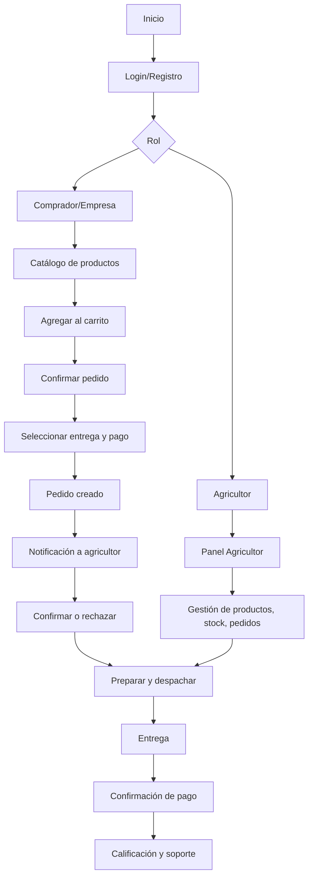

---

## 🔄 Flujo funcional principal del sistema AgroConecta

A continuación se describe el flujo típico de uso del sistema, desde el acceso inicial hasta la gestión de pedidos y pagos, siguiendo la lógica de módulos y roles:

---

### 1. Inicio y autenticación

- El usuario accede a la plataforma.
- Puede registrarse o iniciar sesión.
- Elige su rol: Agricultor, Comprador o Empresa.
- Si es necesario, realiza validación de identidad.

---

### 2. Panel según rol

- **Agricultor:**  
  - Gestiona productos (crear, editar, stock, imágenes).
  - Visualiza y gestiona pedidos recibidos.
  - Consulta reportes y estadísticas.
  - Configura métodos de pago y entrega.

- **Comprador/Empresa:**  
  - Explora el catálogo de productos.
  - Filtra y busca productos.
  - Agrega productos al carrito.
  - Visualiza historial de compras y pedidos activos.
  - Accede a soporte y deja reseñas.

---

### 3. Proceso de compra (rol comprador/empresa)

1. Explora productos y filtra según preferencia.
2. Agrega productos al carrito (valida stock).
3. Confirma el pedido.
4. Selecciona método de entrega y pago.
5. Revisa el resumen y confirma la compra.

---

### 4. Proceso de venta (rol agricultor)

1. Recibe notificación de nuevo pedido.
2. Confirma disponibilidad y acepta/rechaza el pedido.
3. Prepara el pedido y lo marca como "en preparación".
4. Cambia el estado a "en camino" o "listo para recoger" según el método de entrega.
5. Confirma la entrega.

---

### 5. Pagos y confirmaciones

- Si es contraentrega o transferencia, el agricultor valida y marca como pagado.
- Si es pago digital (futuro), la confirmación es automática.

---

### 6. Calificaciones y soporte

- Tras la entrega, el comprador califica el producto/agricultor.
- El agricultor puede responder o calificar al comprador.
- Ambos pueden acceder a soporte y abrir tickets si hay problemas.

---

### 7. Panel administrativo

- El administrador gestiona usuarios, productos, pedidos y reportes.
- Administra categorías, estados, pagos y soporte.

---

### Diagrama de flujo visual (resumido)

---

