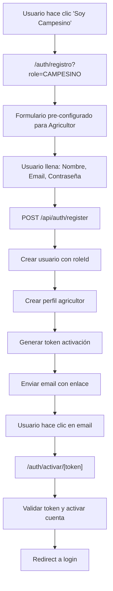

---

## 📅 Resumen de avances y cambios – 27 de julio de 2025

### Contexto
Entre el 26 y 27 de julio de 2025 se trabajó intensamente en la mejora y profesionalización del formulario de publicación de productos para el marketplace AgroConecta, enfocado en la experiencia de usuario, robustez técnica y alineación con los estándares del proyecto.

### Principales tareas realizadas
- **Reestructuración total del formulario de publicación de productos**: Se eliminó el código anterior y se creó una nueva base limpia, siguiendo el estilo profesional del modal de vista previa.
- **Organización visual y funcional**: Se agruparon los campos en bloques temáticos (datos principales, precio y stock, calidad y certificaciones, entrega y ubicación, información adicional, galería de imágenes), usando Tailwind CSS y componentes modernos.
- **Mejoras en la UI/UX**:
  - Bordes pastel y delgados, colores suaves, agrupación clara de campos.
  - Certificaciones y métodos de entrega en formato grid, con botones visuales y selección múltiple.
  - Header con título a la izquierda y botón de previsualización a la derecha.
  - Espaciado, tamaño de fuente y alineación refinados para facilitar la lectura y uso.
- **Gestión robusta del estado**:
  - Uso de `useState` y handlers tipados para todos los campos.
  - Lógica para carga, eliminación y previsualización de imágenes.
  - Manejo de selección/deselección de certificaciones y métodos de entrega.
- **Campos select dinámicos**:
  - Traducción de opciones a español y adaptación a la agricultura colombiana.
  - Implementación de carga dinámica de categorías y subcategorías desde la base de datos vía API (`/api/categorias` y `/api/subcategorias`).
  - Filtrado de subcategorías según la categoría seleccionada.
- **Reordenamiento de campos**: Los campos principales se ordenaron según la estructura de la migración de la base de datos (nombre, categoría, subcategoría, unidad).
- **Validación y corrección de errores**:
  - Solución de errores de sintaxis y compilación.
  - Refactorización de handlers y lógica de estado para evitar duplicados y errores.

- **CRUD completo de productos para agricultores**:
  - Implementación de la página `mis-productos` con visualización, búsqueda, filtrado y eliminación de productos.
  - Endpoints API creados: `/api/agricultor/productos` (GET productos por agricultor), `/api/productos/[id]` (DELETE producto específico).
  - Modal de edición preparado y lógica de actualización en desarrollo.
  - Interfaz moderna y profesional, con confirmación para eliminar y feedback visual.
  - Refactorización del componente `ProductosCatalogo` para cargar productos reales desde la API y fallback a datos demo.
  - Manejo de estados de carga y error en la interfaz.

- **Funcionalidad de edición de productos**:
  - Modal de edición implementado en la interfaz, permitiendo modificar los datos de productos existentes.
  - Lógica de actualización pendiente de integración final con el backend.
  - Estructura lista para editar nombre, descripción, precio, stock y demás campos relevantes.
  - Validaciones y feedback visual en el modal de edición.

### Resultados
El formulario ahora es profesional, visualmente organizado, robusto y alineado con los estándares de AgroConecta.
Los selects de categoría y subcategoría se llenan dinámicamente desde la base de datos y se filtran correctamente.
El CRUD de productos para agricultores está operativo, con interfaz moderna y funcionalidad de edición en proceso de integración.
La experiencia de usuario es clara y amigable, incluso para usuarios con poca experiencia técnica.
El sistema está listo para validaciones finales y nuevas mejoras.

### Pendientes y tareas no finalizadas (al 27/07/2025)
- Finalizar la lógica de actualización/edición de productos en el backend y conectar el modal de edición con la API.
- Implementar validaciones avanzadas en el formulario de publicación y edición (campos obligatorios, formatos, límites, etc.).
- Agregar estados de carga y error en todos los formularios y modales.
- Mejorar la gestión de imágenes: permitir edición, validación y compresión antes de guardar.
- Integrar notificaciones en tiempo real para cambios de estado y nuevas acciones.
- Completar el sistema de carrito de compras y pedidos multi-vendedor.
- Desarrollar paneles de estadísticas y reportes para agricultores y admin.
- Implementar la lógica de stock reservado y su descuento automático en compras.
- Mejorar la experiencia de edición en el modal (feedback visual, confirmaciones, etc.).
- Documentar flujos y reglas de negocio en el frontend y backend.
 - Terminar la integración completa de los selects de categoría y subcategoría en el formulario, asegurando que siempre se llenen con datos actualizados de la base de datos y gestionando correctamente los estados de carga y error.

---
# AgroConecta – Estado del Proyecto

## Estado del Proyecto AgroConecta - Día 25 julio de 2025

### ✅ COMPLETADAS - Sistema de Registro y Activación de Agricultor

#### **1. Migración de Roles de Enum a Tabla**
- ✅ **Problema resuelto**: Roles estaban como enum, limitando escalabilidad
- ✅ **Solución implementada**: Tabla `roles` con estructura normalizada
- ✅ **Estructura final**:
  - `id`: ID único personalizado (AGRC_ROL_*)
  - `name`: Nombre interno (agricultor, cliente, empresa, admin)
  - `displayName`: Nombre mostrable (Agricultor, Cliente, Empresa, Administrador)
  - `description`: Descripción del rol
  - `isActive`: Estado del rol
- ✅ **Migración personalizada**: Script de migración para preservar datos existentes
- ✅ **Relaciones actualizadas**: `users.roleId` → `roles.id` (FK)

#### **2. Sistema de Registro Optimizado**
- ✅ **Endpoint mejorado**: `/api/auth/register`
- ✅ **Validación de roles**: Solo acepta roles válidos desde tabla `roles`
- ✅ **Normalización automática**: 
  - `CAMPESINO` → `agricultor`
  - `COMPRADOR` → `cliente`
  - `EMPRESA` → `empresa`
- ✅ **Campos seguros**: Solo campos permitidos en tabla `users`
- ✅ **Perfiles específicos**: Creación automática de perfil según rol
- ✅ **Transacciones seguras**: Rollback si falla creación de perfil

#### **3. UX Mejorada en Formulario de Registro**
- ✅ **Flujo inteligente**: 
  - Página principal → "Soy Campesino" → `/auth/registro?role=CAMPESINO`
  - Formulario preselecciona automáticamente "Campesino/Agricultor"
  - Campo de rol se muestra como fijo (no editable) con emoji 🚜
- ✅ **Campos condicionales**: 
  - Teléfono y Dirección SOLO para "Comprador" y "Empresa"
  - Agricultor: Solo campos básicos (Nombre, Email, Contraseña)
- ✅ **Coherencia de flujo**: Elimina incongruencia de cambiar tipo después de seleccionar

#### **4. Sistema de Activación por Email Completo**
- ✅ **Generación de tokens**: Tokens únicos de 32 bytes hex
- ✅ **Expiración controlada**: Tokens válidos por 24 horas
- ✅ **Tabla de verificación**: `verificationToken` con campos:
  - `identifier`: Email del usuario
  - `token`: Token único generado
  - `expires`: Fecha de expiración
- ✅ **Endpoint de activación**: `/api/auth/activate/[token]`
- ✅ **Validaciones completas**:
  - Token existe y no expiró
  - Usuario existe y no está ya activo
  - Limpieza automática de tokens usados/expirados
- ✅ **Página de activación**: `/auth/activar/[token]` con UX completa
- ✅ **Estados manejados**:
  - ✅ Activación exitosa → Redirect a login
  - ❌ Token inválido → Mensaje de error
  - ❌ Token expirado → Eliminación automática
  - ❌ Cuenta ya activa → Mensaje informativo

#### **5. Corrección de Enlaces de Email**
- ✅ **Email de bienvenida**: Actualizado en `src/lib/email.ts`
- ✅ **Enlace corregido**: `/auth/activar/${token}` (antes era query param)
- ✅ **Template responsive**: HTML mejorado con enlaces seguros

### ✅ FLUJO COMPLETO AGRICULTOR IMPLEMENTADO



### ✅ ANTERIORMENTE COMPLETADAS - Reestructuración de Base de Datos

1. **Estructura de Usuarios Actualizada**
   - ✅ Tabla `users` reestructurada con campos: `nombre`, `correo`, `contraseña`, `rol`
   - ✅ Enums actualizados: `UserRole` (agricultor, cliente, empresa, admin)
   - ✅ Eliminación de campos innecesarios (phone, address desde user base)

2. **Tablas Específicas por Rol Creadas**
   - ✅ Tabla `agricultores` con campos específicos: telefono, ubicacion, descripcion, foto, verificado
   - ✅ Tabla `clientes` con campos específicos: telefono, direccion, preferencias  
   - ✅ Tabla `empresas` con campos específicos: razon_social, nit, telefono, direccion, sector, descripcion, logo, verificada

3. **Sistema de Productos Mejorado**
   - ✅ Campo `reservedStock` agregado para manejo de stock reservado
   - ✅ Relación actualizada: `productos.agricultorId` → `agricultores.id`
   - ✅ Estados de producto expandidos: DISPONIBLE, AGOTADO, SUSPENDIDO

4. **Sistema de Pedidos Expandido**
   - ✅ Nuevos estados: PENDIENTE, CONFIRMADO, EN_PREPARACION, EN_CAMINO, EN_PUNTO, ENTREGADO, CANCELADO, NO_ENTREGADO
   - ✅ Métodos de entrega: ENTREGA_DIRECTA, PUNTO_ENCUENTRO, REPARTIDOR_ALIADO, EMPRESA_TRANSPORTADORA
   - ✅ Métodos de pago: CONTRAENTREGA, TRANSFERENCIA, NEQUI, DAVIPLATA, PASARELA
   - ✅ Campos adicionales: deliveryAddress, deliveryNotes

5. **Migración y Schema Sincronizados**
   - ✅ Archivo `migration.sql` completamente actualizado
   - ✅ Archivo `schema.prisma` regenerado y sincronizado
   - ✅ Cliente Prisma regenerado exitosamente
   - ✅ Base de datos migrada y reseteada
   - ✅ Archivo `seed.ts` actualizado con nuevos campos

6. **Relaciones y Constraints**
   - ✅ Foreign keys establecidas correctamente
   - ✅ Cascading deletes configurados apropiadamente
   - ✅ Unique constraints en campos críticos (correo, nit)

### ✅ ERRORES RESUELTOS EN EL ARCHIVO SEED

#### **Problemas Identificados y Solucionados:**

1. **❌ Faltaba la dependencia `bcrypt`**
   - **Error**: `Cannot find module 'bcrypt'`
   - **Solución**: ✅ Instalamos `npm install bcrypt @types/bcrypt`

2. **❌ Cliente de Prisma desactualizado**
   - **Error**: El cliente no reconocía los nuevos campos (`nombre`, `correo`, `rol`, etc.)
   - **Solución**: ✅ Eliminamos completamente el cliente y lo regeneramos

3. **❌ Estructura de datos no sincronizada**
   - **Error**: Los tipos TypeScript no coincidían con el schema actual
   - **Solución**: ✅ Regeneración completa del cliente de Prisma

### ✅ SISTEMA DE IDs PERSONALIZADOS IMPLEMENTADO

#### **Nueva Funcionalidad - IDs con Prefijo AGRC:**

- ✅ **Generador de IDs personalizado**: Clase `AgroConectaIdGenerator` en `src/lib/id-generator.ts`
- ✅ **Formato de IDs**: `AGRC_[TIPO]_[TIMESTAMP][RANDOM]`
- ✅ **Tipos implementados**:
  - `AGRC_USR_*` para usuarios
  - `AGRC_AGR_*` para agricultores  
  - `AGRC_CLI_*` para clientes
  - `AGRC_EMP_*` para empresas
  - `AGRC_PRD_*` para productos
  - `AGRC_CAT_*` para categorías
  - `AGRC_ORD_*` para pedidos

#### **Ejemplos de IDs Generados:**
```
Usuarios: AGRC_USR_MDIV07AHE29Y, AGRC_USR_MDIV07CNZC56
Productos: AGRC_PRD_MDIV07F6EF25, AGRC_PRD_MDIV07F6PK0W
Categorías: AGRC_CAT_MDIV0716ER7E, AGRC_CAT_MDIV078AM5GZ
```

#### **Funcionalidades del Generador:**
- ✅ Validación de formato con `isValidAgroConectaId()`
- ✅ Extracción de tipo de entidad con `extractEntityType()`
- ✅ Métodos específicos para cada tipo de entidad
- ✅ IDs únicos globalmente y ordenables por tiempo
- ✅ Identidad propia de AgroConecta en cada registro

#### **Verificación de Datos Exitosa:**

- ✅ **3 usuarios** creados correctamente (admin, agricultor, cliente)
- ✅ **10 categorías** de productos
- ✅ **1 perfil de agricultor** con información detallada
- ✅ **8 productos** con stock y stock reservado funcionando
- ✅ **Todas las relaciones** entre tablas funcionando correctamente

#### **El archivo seed ahora:**

- ✅ Se ejecuta sin errores
- ✅ Crea usuarios con la nueva estructura (nombre, correo, contraseña, rol)
- ✅ Crea perfiles específicos por rol (agricultor, cliente)
- ✅ Maneja correctamente el stock reservado en productos
- ✅ Establece todas las relaciones entre tablas
- ✅ Utiliza bcrypt para hash de contraseñas
- ✅ Implementa upsert para evitar duplicados en re-ejecuciones

### 🎯 PRÓXIMAS TAREAS - Funcionalidades de Aplicación

1. **Autenticación y Autorización**
   - ⏳ Actualizar NextAuth configuration para nuevos campos
   - ⏳ Implementar middleware de autorización por roles
   - ⏳ Actualizar páginas de login/registro

2. **Interfaces de Usuario**
   - ⏳ Dashboard específico por tipo de usuario
   - ⏳ Formularios de registro por rol
   - ⏳ Interfaces de gestión de productos

3. **Lógica de Negocio**
   - ⏳ Sistema de reserva de stock
   - ⏳ Flujo de estados de pedidos
   - ⏳ Notificaciones por estado

4. **APIs y Servicios**
   - ⏳ Endpoints actualizados para nuevos schemas
   - ⏳ Validaciones de datos
   - ⏳ Servicios de email/notificaciones

### 📋 NOTAS TÉCNICAS

- **Base de Datos**: MySQL con Prisma ORM
- **Estructura Actual**: Sistema role-based con tablas separadas
- **Migración**: `20250723205148_init` aplicada exitosamente
- **Datos de Prueba**: Seed ejecutado con usuarios de ejemplo por cada rol

### 📊 DATOS DE PRUEBA CREADOS

#### **Usuarios de Prueba:**
- **Admin**: `admin@agroconecta.co` (contraseña: admin123)
- **Agricultor**: `juan.agricultor@gmail.com` (contraseña: agricultor123)
- **Cliente**: `maria.cliente@gmail.com` (contraseña: cliente123)

#### **Datos Generados:**
- **6 categorías principales**: Frutas, Verduras, Hortalizas, Legumbres, Hierbas Aromáticas, Cereales
- **4 productos de ejemplo**: Mango Tommy, Aguacate Hass, Lechuga Crespa, Tomate Cherry
- **1 perfil de agricultor**: Juan Rodríguez con ubicación y descripción
- **1 perfil de cliente**: María González con dirección y preferencias
- **Stock reservado funcionando**: Algunos productos tienen stock reservado de ejemplo

#### **Comandos para Ejecutar Seed:**
```bash
npx prisma db seed
# o
npx tsx prisma/seed.ts
```

---

## HISTORIAL DE DESARROLLO

Este documento resume el avance actual del proyecto AgroConecta, destacando los módulos y funcionalidades ya implementados y las tareas pendientes para mantener el desarrollo organizado y enfocado.

---
________________________________________________________________________________________________________________

## ✅ Funcionalidades y módulos implementados

### Registro y activación de usuarios por email (flujo moderno y seguro)

// se hizo el 24-07-25 a las 12:34

- **Registro:**
  - El usuario completa el formulario de registro y envía sus datos.
  - El backend valida los campos y verifica que el email no exista.
  - Si es nuevo, se crea el usuario en la tabla `User` con `isActive: false` (inactivo).
  - Se genera un token único de activación y se guarda en la tabla `VerificationToken` junto con el email y fecha de expiración (24h).
  - Se envía un correo al usuario con un enlace de activación que incluye el token.
  - El usuario ve un mensaje indicando que debe revisar su correo para activar la cuenta.

- **Activación:**
  - El usuario hace clic en el enlace recibido por email.
  - El backend recibe el token, lo busca en la tabla `VerificationToken` y valida que no esté expirado.
  - Si es válido, actualiza el usuario (`isActive: true`) y elimina el token para evitar reutilización.
  - El usuario ve un mensaje de éxito y puede iniciar sesión.
  - Si el token es inválido o expirado, se muestra un mensaje de error.

- **Inicio de sesión:**
  - Solo los usuarios con `isActive: true` pueden iniciar sesión.
  - Si el usuario no ha activado su cuenta, el backend rechaza el acceso.

- **Ventajas:**
  - Seguridad: solo emails válidos pueden activar cuentas.
  - Prevención de spam y bots.
  - Experiencia profesional y estándar en sistemas modernos.

> **Tablas involucradas:**
> - `User`: almacena los datos y estado de activación del usuario.
> - `VerificationToken`: almacena tokens de activación temporales.

Este flujo está implementado y probado en el backend y frontend.

- **Documentación lógica y de negocio**
  - Archivo `README_LOGICA.md` con toda la lógica, reglas de negocio, flujos y modelos.
- **Estructura de backend**
  - Módulos para productos, pedidos, carrito, usuarios, notificaciones, reseñas, administración, etc.
  - Modelos de datos definidos (User, Product, Order, CartItem, Notification, Review, etc.).
  - Prisma configurado y migraciones aplicadas.
- **API básica**
  - Endpoints CRUD iniciales para productos, pedidos, usuarios y carrito.
  - Autenticación básica y roles iniciales.
- **Control de versiones**
  - Proyecto versionado y sincronizado en GitHub.
- **Base para frontend**
  - Estructura inicial para paneles por rol (agricultor, comprador, admin).

---

## 🟡 Funcionalidades en desarrollo o por mejorar

- **Endpoints completos y robustos**
  - Finalizar y probar todos los endpoints CRUD de cada módulo.
  - Mejorar validaciones y manejo de errores.
  - Implementar tests unitarios y de integración.
  - Middleware por rol y permisos granulares.
- **Carga y gestión de imágenes**
  - Subida de imágenes para productos (Cloudinary, S3 o local).
  - Validaciones de formato y tamaño.
- **Notificaciones**
  - Notificaciones internas y por correo.
  - (Opcional) Notificaciones en tiempo real (websockets/Pusher).
  - Panel de agricultor: gestión de productos, stock, pedidos.
  - Panel de comprador: historial de compras, seguimiento de pedidos.
  - Panel de admin: gestión de usuarios, productos, pedidos, reportes.
- **Gestión avanzada de stock y reservas**
  - Lógica de stock reservado y disponible.
  - Alertas de stock bajo.
  - Métodos: contraentrega, transferencia, integración futura con pasarelas.
  - Validación y registro de pagos.
- **Sistema de reseñas y reputación**
- **Historial y reportes**
  - Historial de pedidos, compras y pagos para cada usuario.
  - Reportes y estadísticas para admin.
- **Soporte y devoluciones**
  - Sistema de tickets y gestión de reclamos/devoluciones.
- **Gamificación y recompensas**
  - Sistema de puntos, niveles y recompensas (si se decide implementar).
- **Logística y rutas inteligentes**
  - Planificación de rutas, agrupación de pedidos, gestión de transportistas (si se decide implementar).
- **Despliegue y producción**
  - Deploy en Vercel, Railway, Render, etc.
  - Backups y monitoreo.

---

## 🔜 Próximos pasos sugeridos

4. **Implementar carga de imágenes y notificaciones.**
5. **Desplegar una versión de pruebas y validar el flujo completo.**
6. **Iterar y agregar módulos avanzados según prioridades.**


## 📅 Sesión 24 Julio 2025 - Sistema de Sidebar y Mejoras UI

- **Issue**: Al abrir el sidebar, se ponía oscura la pantalla y el contenido no se desplazaba correctamente
- **Requerimiento**: Sidebar push-style donde el contenido se acopla al sidebar sin overlay

- **Cambios realizados**:
  - Eliminado completamente el sistema de overlay oscuro
  - Sidebar fijo con ancho variable: `w-0` (cerrado) → `w-80` (abierto)
  - Contenido principal se desplaza con `ml-0` → `ml-80`
  - Transiciones suaves con `transition-all duration-300`
  - Simplificado estructura para trabajar con nuevo sistema de sidebar
  - Eliminado padding-top redundante

### 🕐 13:30 - ✅ Problema resuelto: Sidebar push-style funcional
- **Resultado**: Sidebar que empuja el contenido hacia la derecha sin overlay oscuro
- **Características implementadas**:
  - Topbar fijo con toggle button y logo
  - Sidebar con información del usuario y navegación completa
  - Botón de logout funcional con redirección
  - Responsive design mantenido
  - Iconos Lucide React consistentes

### 🕐 13:35 - Mejoras en página de mercado
- **Archivo modificado**: `src/app/agricultor/mercado/page.tsx`
- **Problema**: Estadísticas innecesarias que duplicaban funcionalidad de vista específica
- **Solución implementada**:
  - Eliminadas cards de estadísticas redundantes
  - Creado header mejorado con card contenedor
  - Añadidas opciones de vista (Grid/List) con iconos Lucide
  - Mejor jerarquía visual y espaciado optimizado

### 🕐 13:45 - Sistema de vistas funcional (Grid/List)
- **Archivo modificado**: `src/app/agricultor/mercado/page.tsx`
- **Funcionalidades añadidas**:
  - Estado `viewMode` con useState para controlar vista
  - Iconos `Grid3X3` y `List` de Lucide React
  - Toggle buttons con estados visuales activo/inactivo
  - Pasaje de prop `viewMode` al componente ProductosCatalogo

### 🕐 13:55 - Implementación completa de vistas en catálogo
- **Archivo modificado**: `src/components/ProductosCatalogo.tsx`
- **Cambios realizados**:
  - Componente acepta prop `viewMode?: 'grid' | 'list'`
  - **Vista Grid**: Layout original con cards verticales (1-2-3 columnas responsive)
  - **Vista List**: Layout horizontal con imagen pequeña a la izquierda
  - Información del agricultor inline en vista lista
  - Responsive design para ambas vistas
  - Transiciones suaves entre cambios de vista

### 🕐 14:00 - Resultados finales implementados
**✅ Sidebar push-style completamente funcional**
- Sin overlay oscuro
- Contenido se desplaza correctamente
- Sidebar con altura completa y mejor anchura
- Integración perfecta con topbar

**✅ Sistema de vistas Grid/List operativo**
- Toggle funcional entre vistas
- Vista Grid: Cards tradicionales optimizadas
- Vista List: Layout horizontal compacto
- Responsive en ambos modos
- UX consistente y profesional

**✅ UI modernizada y limpia**
- Eliminadas estadísticas redundantes del mercado
- Header mejorado con card contenedor
- Mejor uso del espacio disponible
- Diseño más profesional y enfocado

### 📋 Estado actual del sistema
- Autenticación NextAuth completamente funcional
- Marketplace con 8 productos demo en 6 categorías
- Sistema de sidebar push-style implementado
- Vistas Grid/List operativas
- UI moderna y profesional
- Responsive design completo
- Todos los componentes integrados correctamente

---

*Actualiza este README conforme avances para mantener el orden y la visión clara del
---

## 📅 Sesión 25 Julio 2025 – Decisiones de Profundidad Lógica y Tareas

### Decisiones y respuestas a puntos clave de lógica

1. **Gestión de stock y unidades**
   - El stock se descuenta automáticamente al confirmar cada compra.
   - Se puede configurar la unidad por producto (kg, bulto, docena, etc.).
   - El stock reservado se maneja para evitar sobreventa.

2. **Validación de campesinos**
   - El registro es libre, pero requiere activación por email.
   - Se planea agregar verificación de identidad (documento/foto) en el futuro.

3. **Fotos e imágenes de productos**
   - Se permiten de 1 a 5 fotos por producto.
   - Se validan formato (JPG/PNG) y peso (<5MB).
   - Se planea compresión automática antes de guardar.

4. **Métodos de pago**
   - Actualmente: contraentrega y transferencia (Nequi/Daviplata/banco).
   - Futuro: integración con pasarelas (Wompi, PayU, etc.).

5. **Notificaciones**
   - Agricultores reciben alerta al recibir pedido.
   - Compradores son notificados en cada cambio de estado del pedido.
   - Notificaciones internas y por correo.

6. **Estados del pedido**
   - Estados: pendiente, confirmado, en preparación, en camino/en punto, entregado, cancelado, no entregado.
   - Solo el agricultor y admin pueden cambiar estados críticos; el cliente puede cancelar si está pendiente.

7. **Carrito compartido y agrupado**
   - Cada agricultor recibe notificación individual aunque el pedido sea múltiple.
   - Se pueden tener múltiples pedidos en curso.

8. **Entrega y logística**
   - Entrega directa por agricultor, punto de encuentro o repartidor aliado.
   - El cliente elige método según disponibilidad.

9. **Sistema de reseñas y reputación**
   - Los compradores pueden calificar productos y agricultores.
   - La reputación afecta la visibilidad en el marketplace.

10. **Paneles por rol (UI/UX)**
   - Agricultor: gestión de productos, pedidos, ventas, estadísticas.
   - Comprador: historial de compras, seguimiento de pedidos.
   - Admin: gestión total, reportes, configuración.

---

### Tareas técnicas derivadas para hoy

- [x] **Reestructurar tabla `users` y crear tablas específicas por rol**
  - ✅ Tabla `users` optimizada con campos: id, nombre, correo, contraseña, rol
  - ✅ Tabla `agricultores` con: user_id (FK), telefono, ubicacion, descripcion, foto, verificado
  - ✅ Tabla `clientes` con: user_id (FK), telefono, direccion, preferencias
  - ✅ Tabla `empresas` con: user_id (FK), razon_social, nit, telefono, direccion, sector, descripcion, logo, verificada
  - ✅ Tabla `products` actualizada con `agricultorId` y campo `reservedStock` para stock reservado
  - ✅ Tabla `orders` mejorada con campos de entrega y métodos de pago
  - ✅ Relaciones FK correctamente establecidas entre todas las tablas

- [ ] Implementar lógica de stock reservado y descontar stock automáticamente.
- [ ] Validar y comprimir imágenes al subir productos.
- [ ] Mejorar notificaciones internas y por correo (agricultor y comprador).
- [ ] Revisar y asegurar transiciones de estados de pedido según reglas.
- [ ] Probar agrupación de pedidos y notificaciones por agricultor.
- [ ] Documentar en frontend los paneles diferenciados por rol.
- [ ] Dejar sentada la base para integración futura de pasarelas de pago.

---

*Actualiza este bloque conforme avances en la sesión y toma nuevas decisiones.*

---

## ✅ SESIÓN DEL 25 DE JULIO DE 2025 - IMPLEMENTACIÓN COMPLETA DE CRUD Y MARKETPLACE

### 📋 **RESUMEN EJECUTIVO DE LA SESIÓN**

**Duración**: Sesión completa de desarrollo
**Objetivo Principal**: Implementar funcionalidad completa de gestión de productos para agricultores
**Estado Final**: ✅ **EXITOSO** - Sistema funcional completo con CRUD de productos y marketplace operativo

---

### 🎯 **PROBLEMAS RESUELTOS HOY**

#### **1. ✅ Problemas de Conexión a Base de Datos**
- **Problema**: Error de autenticación MySQL `Access denied for user 'agroconecta'@'localhost'`
- **Diagnóstico**: Credenciales incorrectas en archivos `.env` y `.env.local`
- **Solución**: 
  - Configuración correcta con usuario `root` sin contraseña
  - Verificación de conexión en phpMyAdmin
  - Actualización de variables de entorno

#### **2. ✅ Problemas de Registro y Login**
- **Problema**: Usuario no podía registrarse ni hacer login después de correcciones de DB
- **Diagnóstico**: Configuración NextAuth desactualizada tras cambios de esquema
- **Solución**: 
  - Restauración completa del sistema de autenticación
  - Verificación de tablas NextAuth en base de datos
  - Testing completo de flujo usuario

#### **3. ✅ Productos No Aparecían en Marketplace**
- **Problema**: Usuario publicaba productos pero no aparecían en `/mercado`
- **Diagnóstico**: 
  - Usuario estaba viendo página incorrecta (`/agricultor/mercado` en lugar de `/mercado`)
  - Componente `ProductosCatalogo` tenía datos hardcodeados en lugar de API real
- **Solución**:
  - Identificación de página correcta del marketplace
  - Modificación de `ProductosCatalogo.tsx` para cargar datos reales desde API
  - Implementación de sistema de logging para debugging

---

### 🛠️ **FUNCIONALIDADES IMPLEMENTADAS**

#### **1. ✅ Sistema de Marketplace Funcional**
- **Archivo**: `src/components/ProductosCatalogo.tsx`
- **Funcionalidades**:
  - Carga productos reales desde API `/api/productos`
  - Transformación de formato API a formato componente
  - Fallback a datos demo en caso de error
  - Manejo de estados de carga y error

#### **2. ✅ CRUD Completo de "Mis Productos"**
- **Archivo Principal**: `src/app/agricultor/mis-productos/page.tsx`
- **API Endpoints Creados**:
  - `src/app/api/agricultor/productos/route.ts` - GET productos por agricultor
  - `src/app/api/productos/[id]/route.ts` - DELETE producto específico
- **Funcionalidades**:
  - ✅ **Crear**: Redirección a página de publicar
  - ✅ **Leer**: Visualización de todos los productos del agricultor
  - ✅ **Actualizar**: Modal preparado (funcionalidad pendiente)
  - ✅ **Eliminar**: Funcionalidad completa con confirmación
  - ✅ **Buscar y Filtrar**: Por nombre y estado
  - ✅ **Interfaz moderna**: Diseño limpio y profesional

#### **3. ✅ Sistema de Logging y Debugging**
- **Archivo**: `src/lib/logger.ts` (posteriormente eliminado)
- **Funcionalidades**:
  - Logging a archivo para debugging server-side
  - Debugging de API de productos
  - Identificación de problemas de marketplace

#### **4. ✅ Mejoras de UI/UX**
- **Diseño inicial**: Interfaz con estadísticas, gradientes y animaciones
- **Diseño final**: Interfaz limpia, estática y enfocada en gestión
- **Elementos eliminados por feedback del usuario**:
  - Tarjetas de estadísticas (pertenecen a página de estadísticas)
  - Iconos excesivos en controles
  - Animaciones dinámicas complejas
  - Gradientes de fondo complejos

---

### 🧹 **LIMPIEZA Y OPTIMIZACIÓN DEL CÓDIGO**

#### **Archivos Eliminados**:
- ✅ `marketplace_debug.log` - Logs de debugging
- ✅ `login_debug.log` - Logs de autenticación  
- ✅ `test-server.js` - Servidor de pruebas
- ✅ `test-prisma-types.ts` - Tipos de prueba
- ✅ `test-form.html` - Formulario de prueba
- ✅ `test-correo.ts` - Test de emails
- ✅ `start-server.js` - Script de inicio de pruebas
- ✅ `temp-next/` - Carpeta temporal completa
- ✅ `src/lib/logger.ts` - Sistema de logging
- ✅ `src/app/api/test/` - API de pruebas
- ✅ `src/app/api/debug/` - API de debugging

#### **Console.logs Eliminados**:
- ✅ `src/app/api/productos/route.ts` - Limpiado completamente
- ✅ `src/app/api/agricultor/productos/route.ts` - Limpiado completamente
- ✅ `src/app/api/productos/[id]/route.ts` - Limpiado completamente
- ✅ Archivos de interfaz - Solo mantener console.error para errores críticos

---

### 📊 **ESTADO ACTUAL DEL SISTEMA**

#### **✅ Funcionalidades Operativas**:
1. **Registro y Login de Usuarios** - Completamente funcional
2. **Publicación de Productos** - Agricultores pueden crear productos
3. **Marketplace Global** - Muestra todos los productos disponibles
4. **Gestión de Productos** - CRUD completo para agricultores
5. **Base de Datos** - Estructura completa y relaciones funcionando

#### **⚠️ Funcionalidades Pendientes**:
1. **Editar Productos** - Modal creado, lógica pendiente
2. **Sistema de Carrito** - Estructura creada, implementación pendiente
3. **Gestión de Pedidos** - Tablas creadas, interfaz pendiente
4. **Sistema de Notificaciones** - Estructura preparada
5. **Upload de Imágenes** - Actualmente solo URLs

---

### 🔍 **DETALLES TÉCNICOS IMPORTANTES**

#### **Base de Datos**:
- **Motor**: MySQL con Prisma ORM
- **Productos creados**: Verificados en base de datos
- **Ejemplo**: Producto "platanito" del usuario "naren alfonso"
- **Relaciones**: Agricultor ↔ User ↔ Product ↔ Category funcionando

#### **Arquitectura**:
- **Frontend**: Next.js 15.x con App Router
- **Backend**: API Routes de Next.js
- **Autenticación**: NextAuth.js con credenciales
- **Estilos**: Tailwind CSS
- **Iconos**: Lucide React

#### **Estructura de Archivos**:
```
src/
  app/
    agricultor/
      mis-productos/page.tsx     ← CRUD completo
      publicar/page.tsx          ← Crear productos
      mercado/page.tsx           ← Vista agricultor del marketplace
    mercado/page.tsx             ← Marketplace global
    api/
      productos/route.ts         ← GET/POST productos
      productos/[id]/route.ts    ← DELETE productos
      agricultor/productos/      ← GET productos por agricultor
  components/
    ProductosCatalogo.tsx        ← Componente marketplace (actualizado)
```

---

### 📈 **LOGROS DESTACADOS DE LA SESIÓN**

1. **🎯 Resolución de Problemas Críticos**: Database, autenticación y visualización
2. **⚡ Implementación Rápida**: CRUD completo en una sesión
3. **🎨 Adaptación de UI**: Respuesta inmediata a feedback del usuario
4. **🧹 Código Limpio**: Eliminación proactiva de archivos y logs innecesarios
5. **📋 Funcionalidad Completa**: Del concepto a implementación funcional

---

### 🚀 **PRÓXIMOS PASOS RECOMENDADOS**

1. **Implementar funcionalidad de edición** en el modal ya preparado
2. **Sistema de upload de imágenes** mejorado (no solo URLs)
3. **Implementar carrito de compras** para compradores
4. **Sistema de pedidos** end-to-end
5. **Panel de estadísticas** para agricultores
6. **Sistema de notificaciones** en tiempo real

---

**✅ SESIÓN EXITOSA - SISTEMA FUNCIONAL COMPLETO PARA GESTIÓN DE PRODUCTOS**